# Practica 03 - Desarrollo de una aplicación JEE basado en EJB, JSF y JPA.

Práctica de Plataformas Web en donde se aplican conocimientos de programación hipermedial aplicado al desarrollo de aplicaciones web usando distintos patrones de diseño.

**PRÁCTICA DE LABORATORIO**

**CARRERA** : Computación

**ASIGNATURA** : Plataformas Web

**TÍTULO PRÁCTICA** : Desarrollo de una aplicación JEE basado en EJB, JSF y JPA para el intercambio de datos en una aplicación empresarial.

**OBJETIVOS ALCANZADOS** :

> - Diseñar y desarrollar modelos de software en diferentes niveles de abstracción y modelos de datos a nivel transaccional y analítico con entornos de desarrollo actuales.

**ACTIVIDADES DESARROLLADAS**

<h3><strong>1. Considerar los requerimientos del sistema para el desarrollo del mismo. </strong></h3>

**Objetivo del sistema:** Permitir la facturación de una distribuidora de productos para el hogar.

**Reglas de negocio:**

> - La distribuidora podrá contar con varios productos distribuidos geográficamente en todo el país.

**Requerimientos funcionales:**

1)	**[RF-1]** La aplicación deberá manejar tres roles: “Cliente”, “Empleado” y “Administrador”.

2)	**[RF-2]** Un “Empleado” y “Administrador” podrán iniciar sesión usando su correo y contraseña.

3)	Una vez iniciado sesión el “Administrador” podrá:
> - **[RF-3]** Gestionar bodegas.
> - **[RF-4]** Gestionar productos.
> - **[RF-5]** Gestionar productos por bodega.

4)	Una vez iniciado sesión el “Empleado” podrá:

> - **[RF-6]** Gestionar clientes.
> - **[RF-7]** Gestionar facturas (disminuir stock, anulación de facturas, búsqueda de facturas).

**Requerimientos no funcionales:**

1)	**[RNF-SEG-1]** El sistema deberá manejar sesiones y filtros.

2)	**[RNF-SEG-2]** El sistema deberá manejar una parte pública (index.xhtml) y otra privada (RF).

3)	**[RNF-DIS-1]** El sistema debe aplicar los patrones de diseño MVC y Facade.

> - **Modelo:** Entidades de Java.
> - **Vista:** JSF + JSTL.
> - **Controlador:** EJB.

4) **[RNF-BD-1]** La persistencia de datos deberá ser a través de JPA y aplicando Criteria y JPQL.

5)	**[RNF-USA-1]** El sistema, en su parte pública presentará un catálogo de productos filtrados por categorías y bodegas.

6)	**[RNF-USA-2]** Las páginas del sistema deben contar con una experiencia e interfaz de usuario apropiada.

7)	[RNF-USA-3] El sistema presentará una interfaz gráfica desarrollada en base a plantillas de Bootstrap o Primefaces.

8)	[RNF-USA-4] El sistema deberá implementarse usando AJAX para una mejor experiencia de usuario.

9)	[RNF-USA-5] El sistema deberá presentar una página de error si se ingresan rutas erróneas.

10)	[RNF-USA-6] El sistema se deberá manejar con reglas de navegación.

**Nota:** Los productos serán filtrados por la bodega y categoría

<h3><strong>2. Desarrollar una aplicación con tecnología JEE para gestionar requerimientos de compra en la web. </strong></h3>

**Herramientas utilizadas:**
> - **IDE:** Eclipse (2020-03), **JDK:** v1.8
> - **SGBD:** MariaDB, Nombre de la BD: practica03
> - **SVR de aplicaciones:** Glassfish v5.0.1
> - **Otros:** Primefaces v8.0, all-themes v1.0.10

A. Consideraciones Generales

El desarrollo de la aplicación web se ha realizado siguiendo las recomendaciones y requerimientos planteados. Para tener una mejor organización se ha divido el modelo y controlador en 6 paquetes de acuerdo con su contenido: controller, ejb, entitties, filters, test y utils.

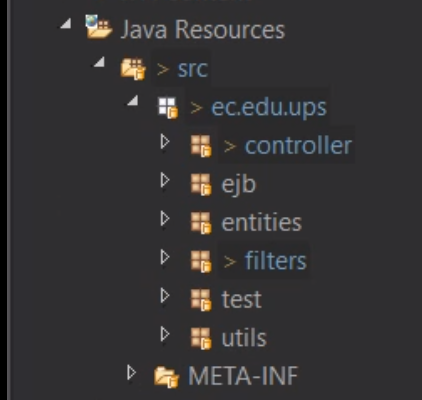

En el paquete controller, se encuentran los EJB que realizan las funciones CRUD, List y otros métodos auxiliares para cada uno de los modelos que se pudieron abstraer durante el análisis de los requerimientos. 

En el paquete entities se encuentran las entidades de Java, los cuales son: Product, User, City, Category, Bill Head y Bill Detail, Warehouse y Product Warehouse. Estos serán necesarios para trabajar con JPA.

Para la persistencia de datos, las interfaces y clases se encuentran distribuidas en el paquete ejb que es en donde se aplica el patrón Facade. Además, para poder manejar la seguridad y control de acceso a las funcionalidades se crearon filtros, los cuales se encuentran en el paquete filter.

Adicionalmente, para comprobar el funcionamiento de la conexión con la base de datos, e ir probando las funcionalidades se creó el paquete test para crear clases de prueba, esto sirvió más que nada al principio de la realización de la práctica.  Finalmente, en el paquete utils se encuentran recursos que complementan al proyecto, se puede resaltar el algoritmo para la validación de una cédula ecuatoriana.

Así mismo, para la parte de la vista se ha organizado por carpetas dependiendo del tipo de archivo, esto incluye las hojas de estilos, las imágenes e íconos. Cabe resaltar que se han dividido las páginas JSF en dos: la parte pública y la privada (y esta a su vez para administradores y empleados).

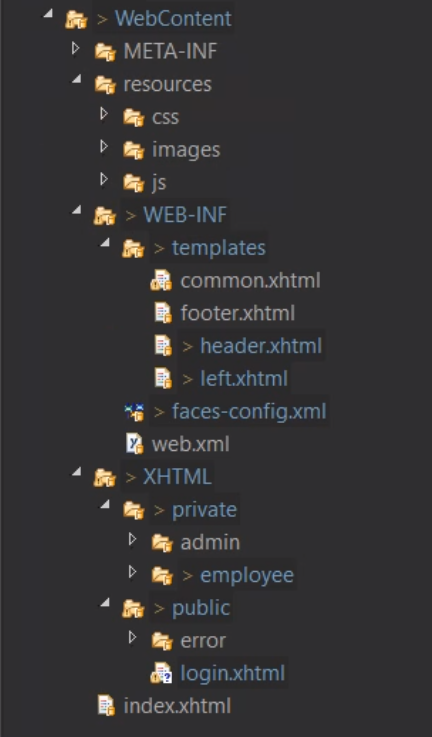

Tal como se planteó en los requerimientos, la parte pública es una página que muestra una vista general del sistema, en la cual, se presenta un catálogo de productos con posibilidad de filtrarlos tanto por bodegas y categorías. Además, se pide como requerimiento no funcional que el sistema tenga una experiencia de usuario apropiada, por tal se diseñó una interfaz de usuario intuitiva aplicando estilos modernos y minimalistas, para esto se usó un tema de Primefaces.

Además, se pide crear una página personalizada para el caso de que no se encuentre una página, o que se ponga mal la ruta de la misma. Esto se puede visualizar en la siguiente Ilustración.

B.	Autentificación de usuarios y seguridad

Por requerimientos, para ingresar a las funcionalidades del sistema, se deberá realizar primero una autentificación de usuarios, la cual identificará dos roles:  Administradores y Empleados. Para ello se aplican los filtros mediante el uso de sesiones para lograr este requisito de seguridad; que, en caso de no cumplirlos, se redirigirá a otra página.

A continuación, se puede ver tanto la página web en donde se realiza el proceso de autentificación, como un ejemplo de los filtros que se usan en la aplicación web.

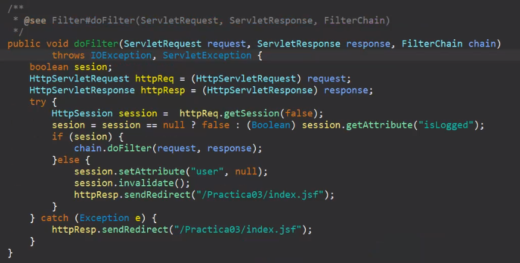

C.	Requerimientos para Administrador

Para los requerimientos de un “Administrador”, se solicitaba que pueda realizar la gestión (CRUD) las entidades: “Product”, “Warehouse” y “ProductWarehouse”, que sería básicamente la gestión de los productos y las bodegas. Para ello se ha pensado en dos páginas para el rol de administrador.

La primera, “product.xhtml” es donde podrá gestionar los productos que se encuentran a nivel de toda la distribuidora. En esta página, se puede crear nuevos productos en base a una categoría (definida previamente en la BD), además, cuenta con una tabla dinámica que integra búsquedas y paginación de los productos ya registrados en el sistema. Así mismo, se podrá modificar el nombre del producto o eliminarlo de manera lógica. Cabe resaltar que se presentará también el stock general que tenga el producto a nivel nacional (de todas las bodegas).

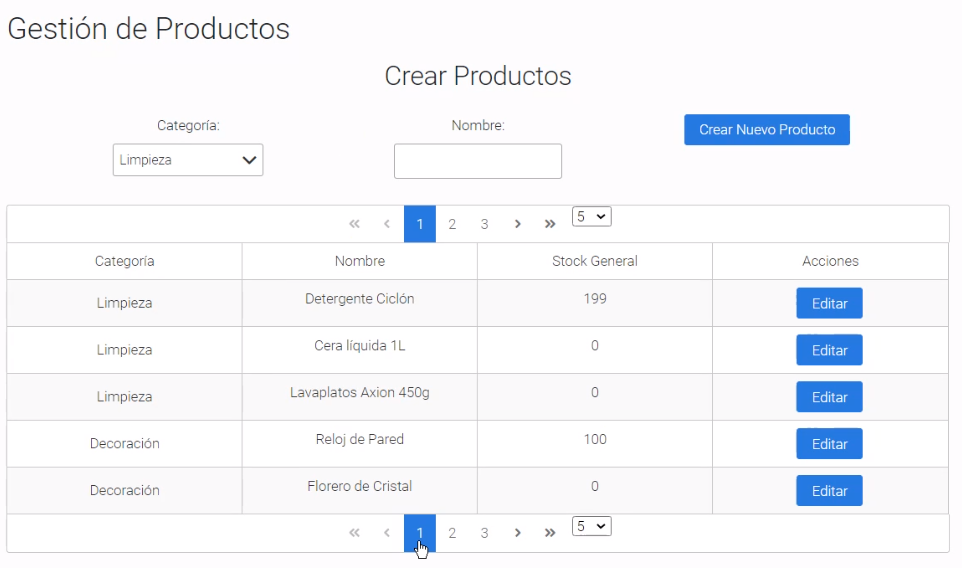

La segunda página, “warehouse.xhtml”, contiene los formularios y las tablas necesarias para realizar tanto la gestión de las bodegas, y de los productos de cada una de ellas; esto debido a que cada bodega puede tener los mismos productos, pero con diferentes valores de stock. Así mismo, como en la página explicada anteriormente, se pueden realizar las funciones CRUD. Esto se realiza a través de AJAX, y Primefaces para tener una mayor flexibilidad y experiencia de usuario en la vista.

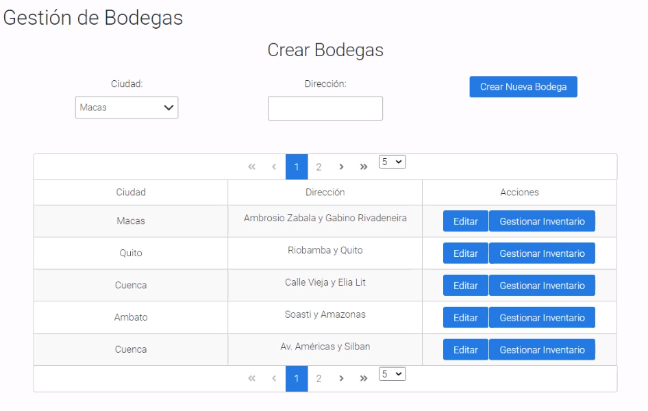

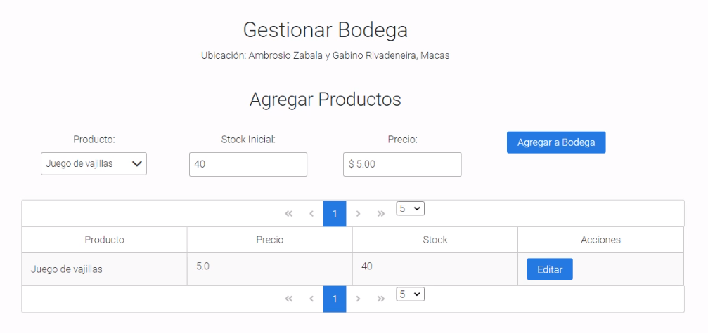

D.	Requisitos para Empleado

Para la parte de las funcionalidades para “Empleados”, tenemos la gestión de clientes y facturas. Para lo cual se han creado 3 páginas, dos destinadas para los procesos de facturación y la última para la gestión de clientes. Cabe resaltar que la persistencia de usuarios “Administradores” y “Empleados” se lo hizo directamente en la base de datos, sin la necesidad de usar una vista.

La primera página, “user.xhtml”, se encarga de realizar todas las funciones CRUD de clientes. Tiene en la parte superior un formulario para crear clientes. Luego, una tabla dinámica donde se puede buscar un cliente dado determinada cédula, y por último otra tabla dinámica en donde se listan a todos los clientes almacenados en la base de datos.

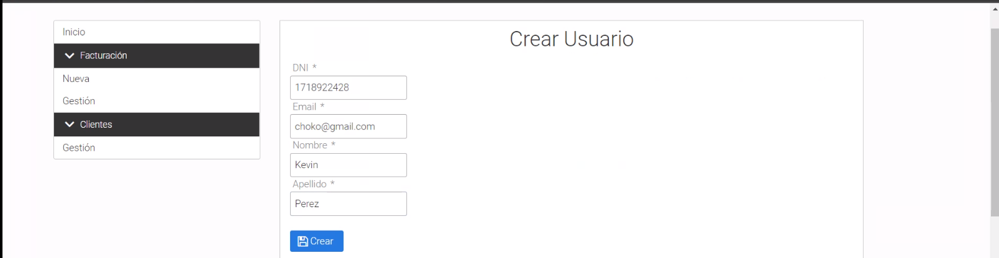

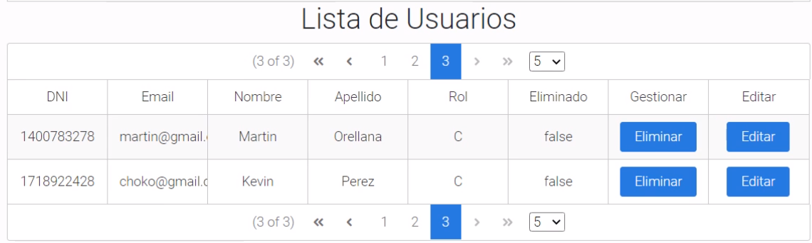

La segunda, “billing.xhtml”, realiza principalmente el proceso de facturación de productos para un cliente determinado, el cual se obtuvo previamente mediante una búsqueda. Aquí, se pueden agregar los productos requeridos, para tal fin se puede realizar un filtrado en base a la ubicación de la bodega así como las categorías de los productos.

El proceso para la facturación es como sigue: se busca y selecciona un cliente, después se muestra el catálogo (con opciones de filtrado) para obtener los productos que se quiere facturar, y posteriormente aparecer un detalle dinámico. Para finalizar, se le debe dar a “Confirmar compra”.

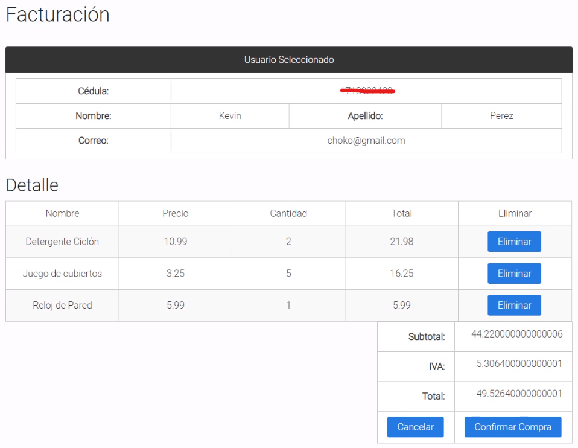

La última página, “bill_management.xhtml”, se enfoca en realizar una gestión más específica de las facturas. Se listan todas las facturas almacenadas en el sistema, las cuales pueden ser filtradas tanto por el usuario (mediante cédula) o por fechas (en un rango determinado). También se puede anular una factura en caso de ser necesario. Uno de los principales objetivos de esta página es hacer un seguimiento a los detalles de las facturas.

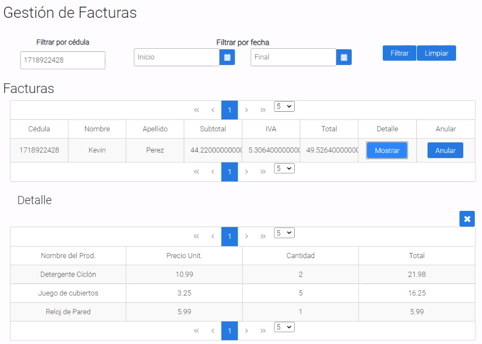

E.	Persistencia de datos

Como se planteó para la persistencia de datos, se ha hecho uso del patrón Facade, en conjunto con JPA (Java Persistence API). Esta combinación en la persistencia hace que se aproveche de manera óptima el trabajar con EJB y sus transacciones declarativas y de seguridad. Por una parte el patrón Facade quita complejidad al código, y JPA hace que el contexto de la programación orientada a objetos no se pierda en la capa de persistencia de datos.

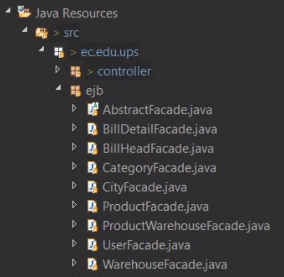

Para realizar las consultas necesarias a la base de datos, se utilizó tanto sentencias JPQL como consultas mediante Criteria. A continuación se presentará un ejemplo de cada una de ellas.

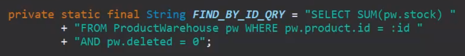

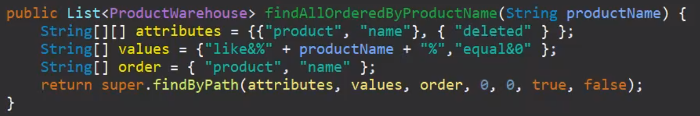

F.	Consideraciones finales

También se tiene en cuenta que la página “index.xhtml” contiene el catálogo con opción a ser filtrado en base a bodegas y categorías.

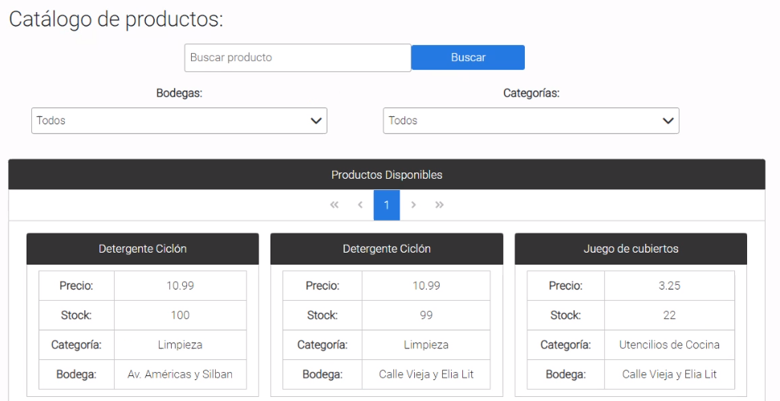

Otro punto para abordar es la utilización de reglas de navegación para controlar los menus laterales de las vistas.

**Ejemplo de Credenciales:**

**Admin:** e-mail = eduardo@gmail.com password = admin1
**Empleado:** e-mail = martin@gmail.com password = martin

**RESULTADO(S) OBTENIDO(S)**:

> - Se logró implementar un sistema web aplicando diferentes tipos de patrones de diseño orientados a negocios.
> - Se logró comprender ciertos aspectos acerca de la importancia del uso de patrones de diseño para la persistencia de datos.
> - Se logró entender las ventajas del uso de JPA.
> - Se logró comprender e implementar diferentes frameworks para el desarrollo de las páginas web, tales como Primefaces.

**CONCLUSIONES** :

> - Primefaces es un framework bastante dinámico que permite realizar diversas funcionalidades en las aplicaciones web gracias a su librería y componentes. Además de implementar diferentes temas sin la necesidad de recurrir a procesos complicados.
> - El uso de JSF con EJB permite una tener una mayor flexibilidad en el código, además de simplificar procesos de comunicación entre capas, al mismo tiempo que brinda mejores características de seguridad.

**RECOMENDACIONES** :

> - Considerar el uso de Primefaces para implementar algunos componentes dentro de la aplicación.
> - Revisar el contenido teórico del tema, además de bibliografía pertinente.
> - Realizar las preguntas respectivas al docente encargado.
> - Aplicar conceptos de HCI para el desarrollo de la GUI.
> - Haber asistido a las sesiones de clase.

**Estudiantes:** 

- Sarmiento Douglas Bryan Sarmiento.
- Serpa Pulgarin Roberto Carlos
- Zhizhpon Tacuri Cesar Eduardo 