# Practica 04 - Desarrollo de una aplicación JEE basado en EJB, JSF y JPA y WS.

Práctica de Plataformas Web en donde se aplican conocimientos de programación hipermedial aplicado al desarrollo de aplicaciones web usando distintos patrones de diseño.

**PRÁCTICA DE LABORATORIO**

**CARRERA** : Computación

**ASIGNATURA** : Plataformas Web

**TÍTULO PRÁCTICA** : Desarrollo de dos aplicaciones JEE basado en EJB, JSF, JPA, y WS para el intercambio de datos en una aplicación empresarial.

**OBJETIVOS ALCANZADOS** :

> - Diseñar y desarrollar modelos de software en diferentes niveles de abstracción y modelos de datos a nivel transaccional y analítico con entornos de desarrollo actuales.

**ACTIVIDADES DESARROLLADAS**

<h3><strong>1. Considerar los requerimientos del sistema para el desarrollo del mismo. </strong></h3>

Con base a la práctica: **“Práctica de laboratorio 03 – EJB – JSF - JPA”**, se solicita agregar nuevas funcionalidades en base a los siguientes requerimientos, y consideraciones.

**Objetivo del sistema:** 

> - Permitir la facturación de una distribuidora de productos para el hogar.
> - Permitir la gestión de cuentas de clientes, además de gestión de pedidos.

**Reglas de negocio:**

> - La distribuidora podrá contar con varios productos distribuidos geográficamente en todo el país.
> - Los usuarios solo se podrán crear una cuenta si es que están previamente registrados en el sistema; en caso de no estarlo, no se podrán ni registrar ni iniciar sesión. Los datos para crear la cuenta serán los que posean 
> - Los pedidos realizados por usuarios podrán tener los siguientes 5 estados: “Enviado”, “Receptado”, “En proceso”, “En camino”, y “Finalizado”. Una vez se encuentre en “Receptado”, se realizará la factura.

 

**Consideraciones adicionales:**

1) **[Despliegue en la Nube]**

Usando los recursos disponibles para los alumnos de la UPS, se solicita desplegar una instancia de una máquina virtual usando la plataforma de Microsoft Azure.

2)	**[Integración Continua]** 

Se pide implementar un servidor de CI usando Jenkins. En la cual se integrará tanto GttHub, como Glassfish para realizar tareas de build y deploy de la aplicación de la distribuidora.

<h3><strong>2. Desarrollar una aplicación con tecnología JEE para gestionar requerimientos de compra en la web. </strong></h3>

**Herramientas utilizadas:**
> - **IDE:** Eclipse (2020-03), **JDK:** v1.8
> - **SGBD:** MariaDB, **Nombre de la BD:** practica03
> - **SVR de aplicaciones:** Glassfish v5.0.1
> - **Jenkins:** 2.263.3 LTS
> - **OS de VM:** Windows 10 
> - **Maven:** 3.6.3
> - **Otros:** Primefaces v8.0

**A.	Desarrollo de Servicios Web: Gestión de Clientes**

**Inicio de Sesión:**
Se compara el username/email y el password que se envía al servicio con la base de datos, y se validan. (Método POST)

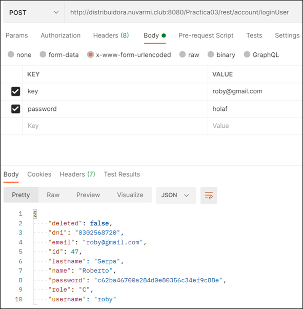

 

**Registro de cuenta:**
Primeramente se verifica que la cédula del cliente que se quiere registrar se encuentre previamente en la base de datos, luego, se validan los datos. Finalmente, se crea la cuenta del cliente. (Método PUT)

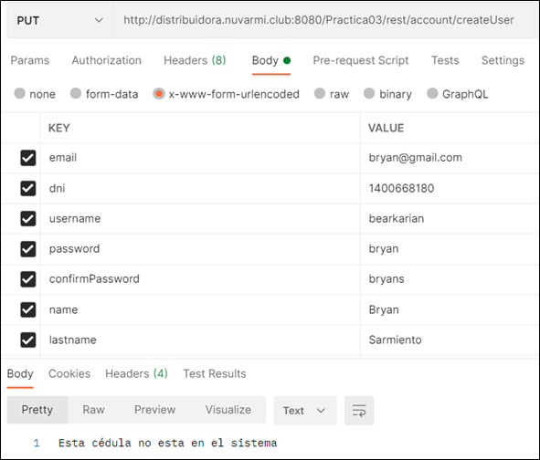

 

**Actualización de datos de cuenta:**
Se envía el ID del cliente, se valida que no se repitan los datos con otros usuarios, y se comprueba la contraseña, por seguridad. (Método PUT)

 

**Anulación de cuenta:**
Mediante el ID del cliente, se elimina de manera lógica la cuenta de ese cliente. (Método PUT)

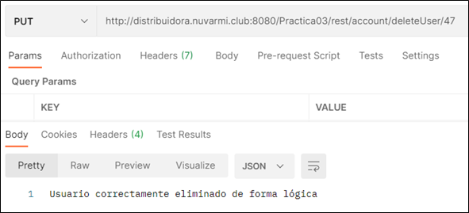

 

**B.	Desarrollo de Servicios Web: Gestión de Pedidos**

**Listado de productos por bodega:**
Para el listado de los productos, se necesita enviar el id de una bodega, seguido del id de una categoría. Estos, están en el URL para obtenerlos con la anotación “PathParam”. Finalmente, se realiza una consulta a la base de datos y el servicio retorna una lista de productos convertidos a JSON. (Método GET)

 

**Envío de solicitud de pedidos:**
Para la creación de un pedido, se necesita un formulario con los parámetros: userId, address, productId y amount, Donde, productId y amount, se puede repetir las veces que sea necesarias para realizar un pedido con varios productos. Finalmente, al persistir en la base de datos, se establece el estado de “Enviado”. (Método POST)

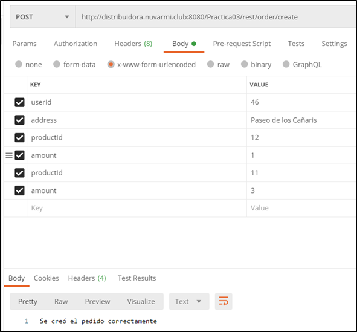

También, al momento de que el pedido pase a estado “Receptado”, se realza la respectiva facturación con los productos del pedido, manteniendo la relación para poder referenciar a qué pedido corresponde dicha factura.

 

**Comprobación del estado del pedido:**
Para comprobar el estado de los pedidos de un usuario, se necesita que se envíe en la URL el id del mismo. Para después, ser obtenido con la anotación “PathParam”. Finalmente se realiza una consulta en la base datos para retornar una lista de pedidos junto con su respectivo estado convertido en JSON. (Método GET)

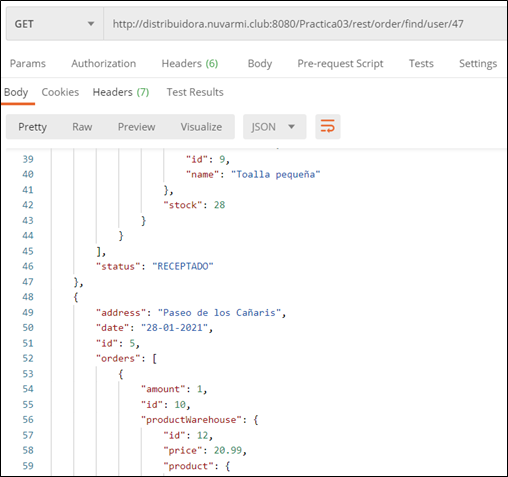

 

**C. Despliegue e Integración Continua**

Como requerimientos para la realización de la práctica, y tal como estaba previsto en el contenido de aprendizaje de la asignatura, se pide implementar en el proyecto el servidor de Jenkins para realizar una integración continua básica mediante GitHub y Glassfish. Además, se pide desplegar la aplicación web realizaba en la nube.

**Despliegue en la nube:**

Para el despliegue en la nube, se solicita usar la plataforma Microsoft Azure, a la cual los estudiantes de la Universidad Politécnica Salesiana tienen acceso. Por lo tanto, se creó una instancia de máquina virtual, en este caso una con características de hardware básicas debido a que para esta práctica no se requiere mucho procesamiento. 

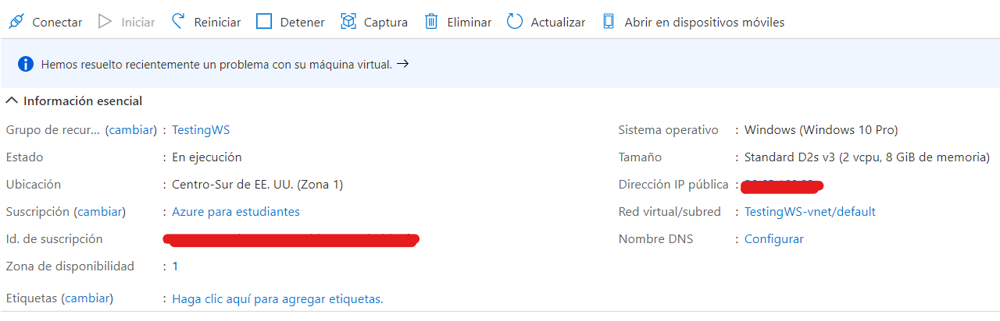

Además, a fin de preparar el servidor para el despliegue y la integración continua se instalaron y configuraron las siguientes herramientas: JDK 8, Maven, Glassfish, Jenkins, Git, Xampp, siendo el último el gestor para la base de datos.

En cuanto a las reglas de red, se agregó una para permitir el tráfico desde afuera del servidor en la nube, para así poder acceder a la aplicación de la distribuidora, como a los dashboards de administrador del Jenkins y del Glassfish.

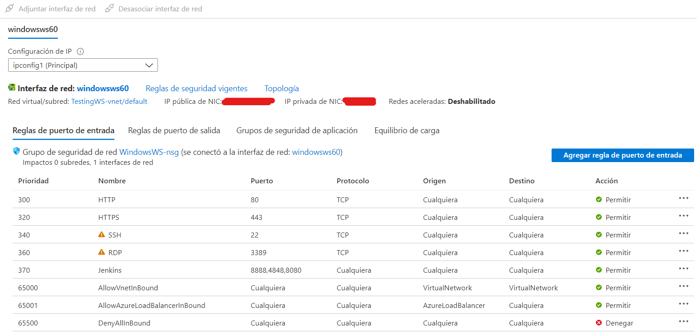

**Integración Continua:**

Para la integración continua, como se mencionó, se instaló y configuró Jenkins. Para ello se crearon dos tareas: Build y Deploy. En la primera tarea, Jenkins se integra con GitHub para detectar cambios en la rama principal (master), en caso de que lo haga, se hará un “clean” y un install del proyecto, para posteriormente generar un archivo *.war. A continuación, las siguientes ilustraciones mostrarán las configuraciones de esta tarea.

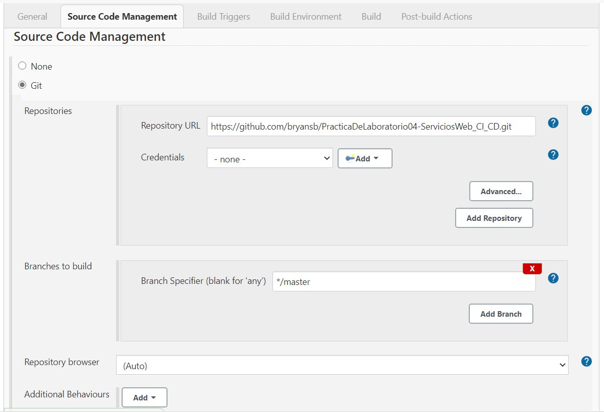

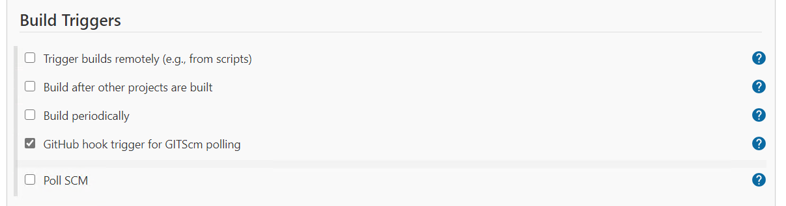

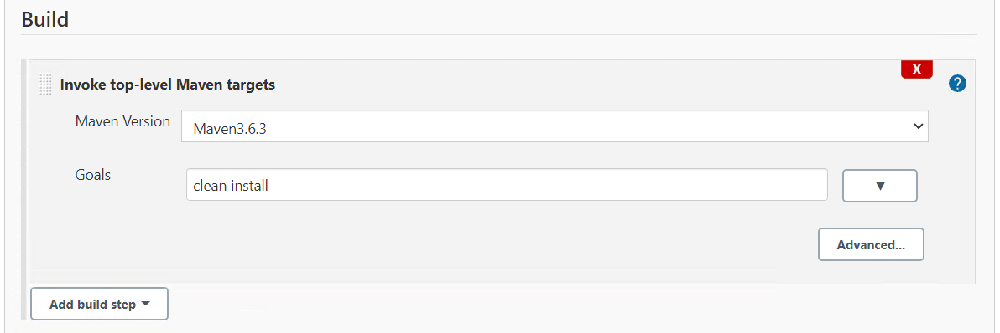

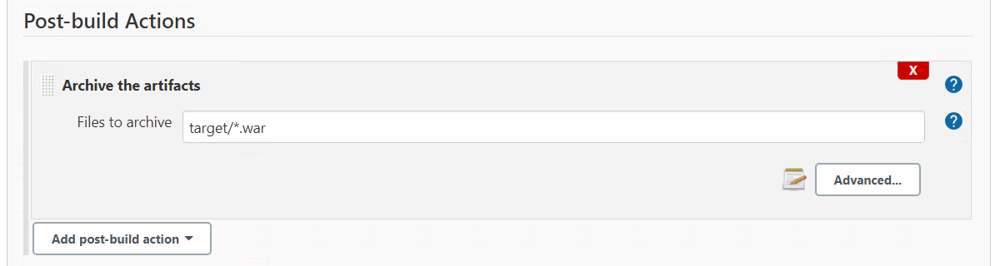

La segunda tarea, Deploy, se ejecuta después de que la tarea Build se complete con éxito. Aquí, se copiará el archivo *.war generado anteriormente hacia la carpeta “autodeploy” del Glassfish, lo cual actualizará la aplicación de la distribuidora en la nube. A continuación, se mostrarán las configuraciones necesarias para realizar esta tarea.

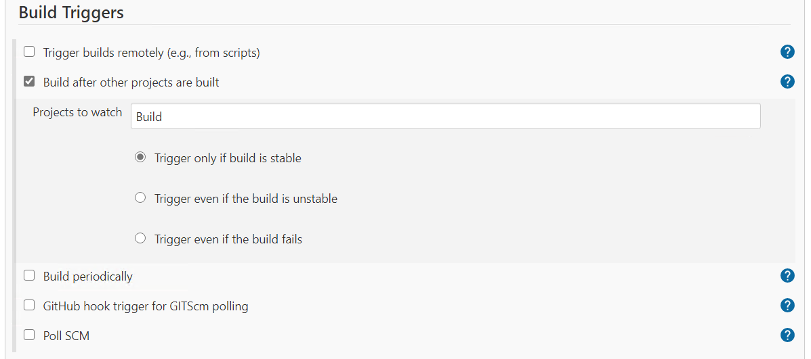

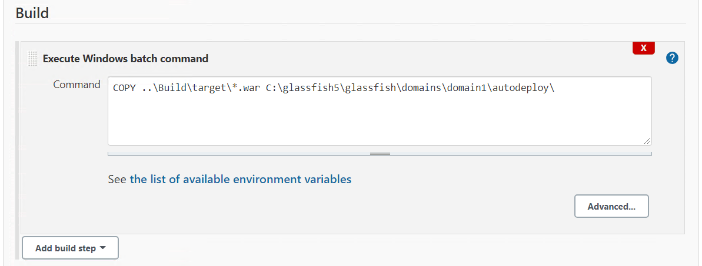

**RESULTADO(S) OBTENIDO(S)**:

> - Se logró implementar un sistema web aplicando diferentes tipos de patrones de diseño orientados a negocios.
> - Se logró comprender ciertos aspectos acerca de la importancia del uso de patrones de diseño para la persistencia de datos.
> - Se logró comprender e implementar diferentes servicios web en la aplicación desarrollada para realizar determinadas tareas.
> - Se logró comprender la importancia y utilidad de desarrollar aplicaciones mediante un entorno de integración continua.
> - Se logró desplegar la aplicación en un entorno de producción en la nube a través de un servidor de integración continua.

**CONCLUSIONES** :

> - La importancia de usar servidores de integración continua es de gran importancia, debido a que permite tener más ventajas antes de desplegar una aplicación en un ambiente de producción, como la detección temprana de errores, automatización de pruebas, automatización de procesos, entre otros.
> - Hay varias plataformas que ofrecen servicios de hosting, la elección entre uno u otro dependerá de las ofertas tanto de hardware, software y de precios.
> - POSTMAN es una aplicación útil para consumir y testear el consumo de servicios web de una manera sencilla y con varias herramientas para obtener varios resultados.

**RECOMENDACIONES** :

> - Revisar el contenido teórico del tema, además de bibliografía pertinente.
> - Realizar las preguntas respectivas al docente encargado.
> - Aplicar conceptos de HCI para el desarrollo de la GUI.
> - Haber asistido a las sesiones de clase.
> - Incluir el archivo glassfish-web.xml en el proyecto. Esto con el fin de un correcto despliegue en el servidor.

**Estudiantes:** 

- Sarmiento Douglas Bryan Sarmiento.
- Serpa Pulgarin Roberto Carlos
- Zhizhpon Tacuri Cesar Eduardo 